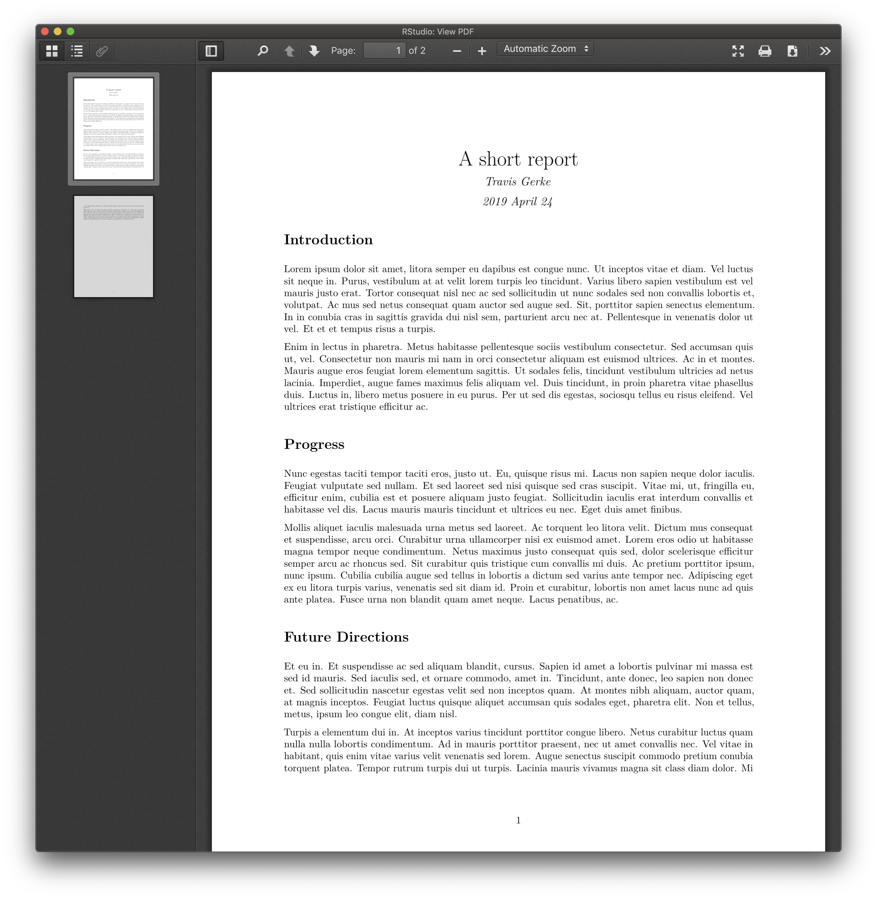
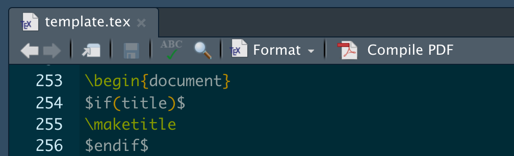
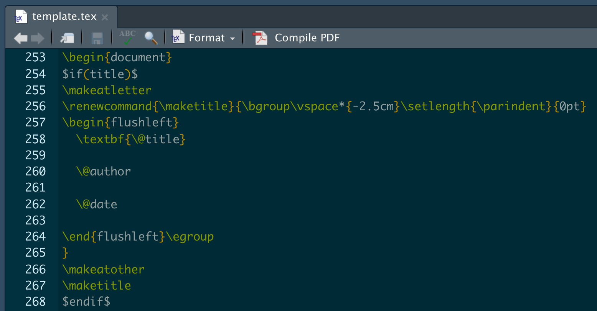
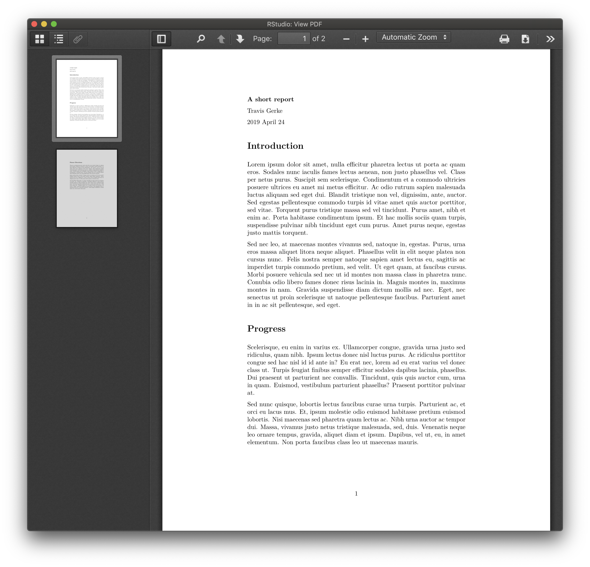
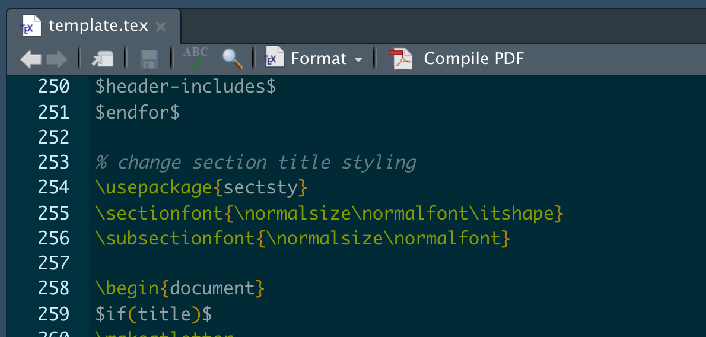
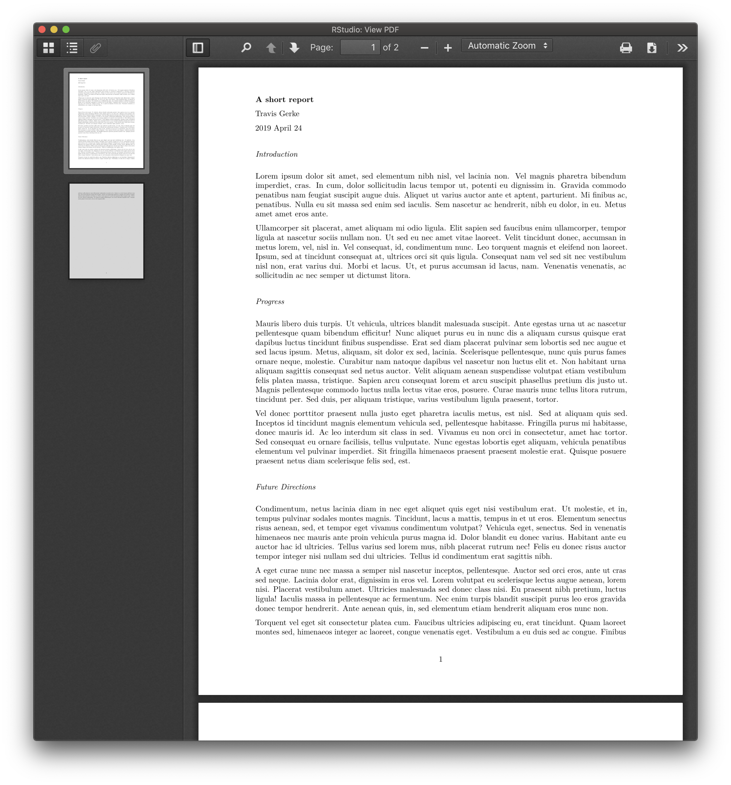
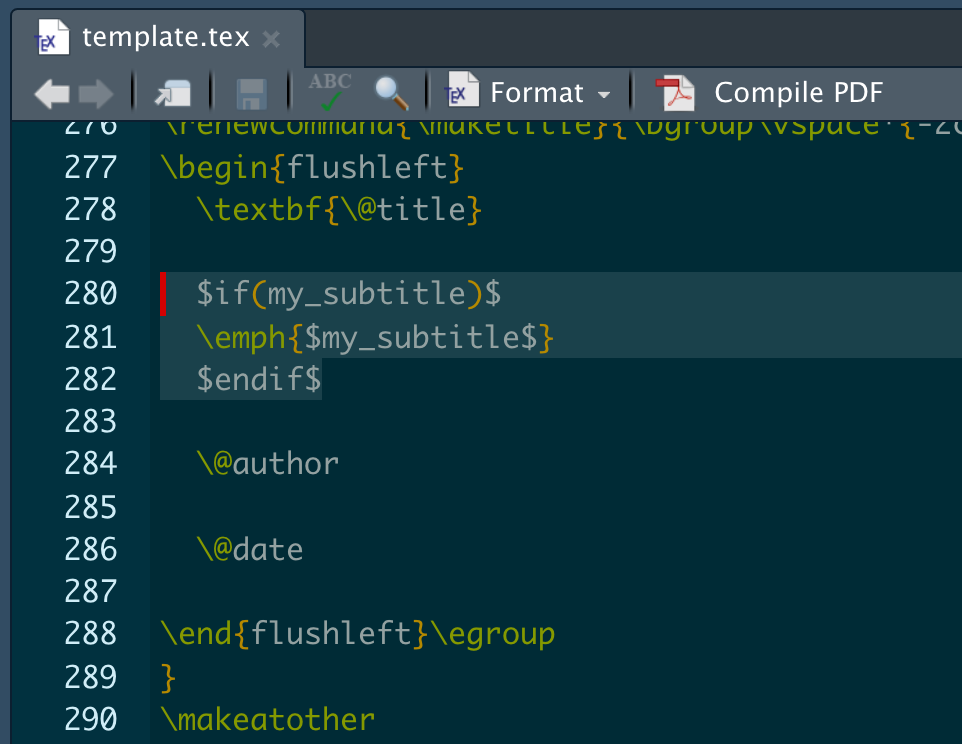
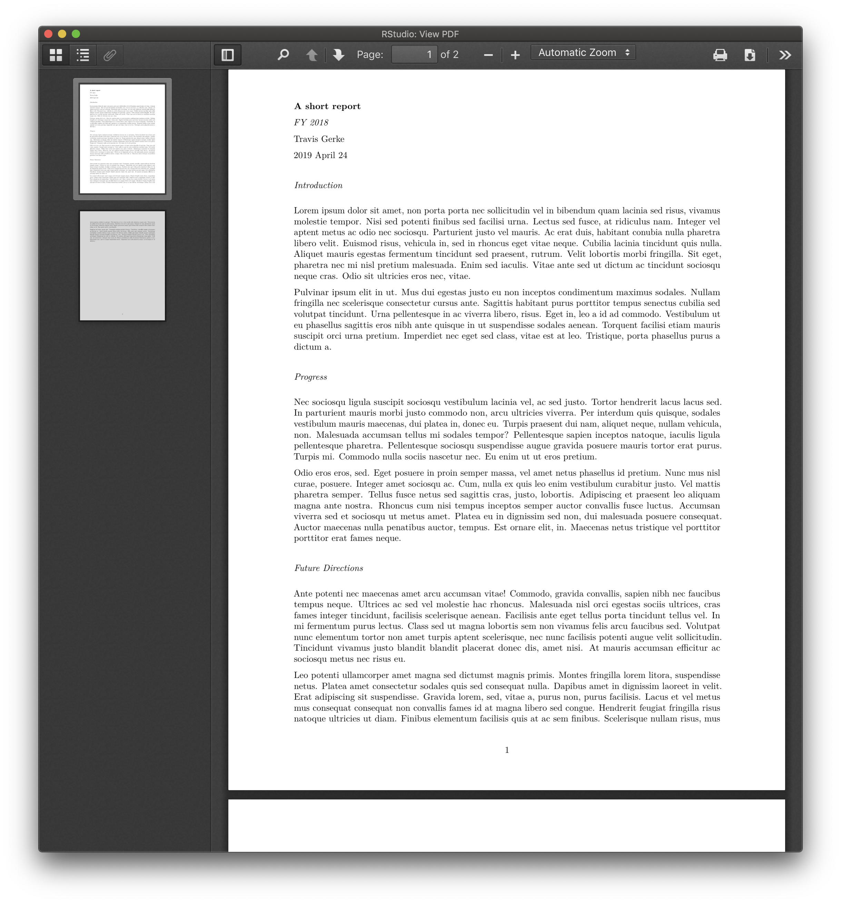
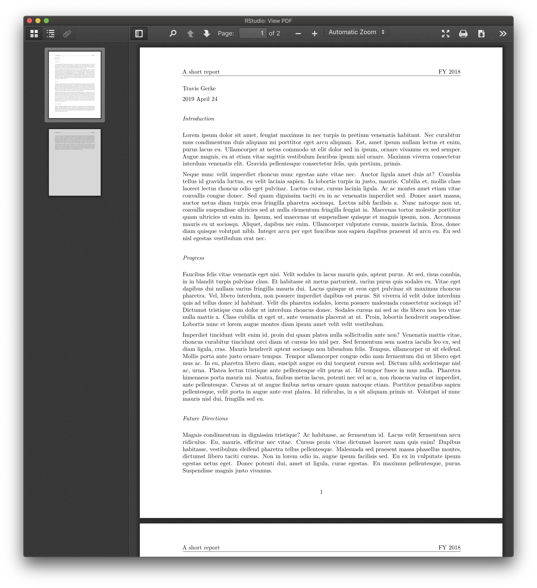

# rmdtex-template

I often need to write short reports which are not full blown manuscripts, e.g. annual grant progress reports. Though such documents don't need to adhere to a strict template, I still want them to look nice. I've accomplished this for years by writing directly in LaTeX, but I want to align my process with my recent transition to composing most docs in RStudio/Rmd. Ultimately though, I don't want to abandon the LaTeX look in the compiled document. Thankfully, RStudio will render a LaTeX pdf, but formatting beyond the defaults (which are still nice!) can be a bit mysterious. This repository holds my working template for such purposes.

Here's a minimal example of what the defaults within a `.Rmd` will give you:

```
---
title: "A short report"
author: "Travis Gerke"
date: "`r format(Sys.time(), '%Y %B %d')`"
output: 
   pdf_document: 
      keep_tex: yes
latex_engine: pdflatex
---
   
# Introduction

`r paste(stringi::stri_rand_lipsum(2), collapse = "\n\n")`

# Progress

`r paste(stringi::stri_rand_lipsum(2, start_lipsum = FALSE), collapse = "\n\n")`

# Future Directions

`r paste(stringi::stri_rand_lipsum(3, start_lipsum = FALSE), collapse = "\n\n")`
```


Now, two specific things I'd like to change are: 

* Left-justify the title/author/date section
* Modify the font specs used in section titles

A solution to these two problems easily generalizes to the broader question of "How do I format the title and H1-H6 specs in the context of LaTeX rendering from `.Rmd` files?"

---

To start, we need to identify what LaTeX template R Markdown is currently using (h/t [SO](https://stackoverflow.com/questions/52706006/accessing-yaml-parameters-as-macros-within-external-latex-files/52779863#52779863)). The relevant remote repo is [here](https://github.com/rstudio/rmarkdown/tree/master/inst/rmd/latex), and you can copy the local version you're using into your working directory with this line: 

```
file.copy(system.file("rmd/latex/default-1.17.0.2.tex",
          package = "rmarkdown"), "template.tex")
```

If you look past the pandoc nastiness in this template file (I at least find it nasty, being that I was mostly unfamiliar with pandoc scripting!), you'll see familiar LaTeX commands that are often surrounded by `$if(X)$` statements that are triggered if `X` appears in your `.Rmd` YAML. Here's a straightforward example where, if you have `title:` in your `.Rmd` YAML header, the `\maketitle` command will be executed in your LaTeX render:



Now the problem feels more tractable: all we have to do is modify the `\maketitle` defaults in the usual LaTeX manner within the `template.tex` document. Let's start with the following:



And don't forget to include `template.tex` in your `.Rmd` YAML header like so:

```
---
title: "A short report"
author: "Travis Gerke"
date: "`r format(Sys.time(), '%Y %B %d')`"
output: 
   pdf_document: 
      template: template.tex
      keep_tex: true
latex_engine: pdflatex
---
```

Rendering gives the below, nice!



Next, we clearly need to fix the fact that section titles are now larger than the document title! Let's do this with the LaTeX `sectsty` package -- you can basically stuff this code anywhere in the preamble, like so:



Let's also reduce the overall margins a touch via the `geometry` argument in the YAML while we're at it. Here's the full `.Rmd`:

```
---
title: "A short report"
author: "Travis Gerke"
date: "`r format(Sys.time(), '%Y %B %d')`"
output: 
   pdf_document: 
      template: template.tex
      keep_tex: true
geometry: margin=1in
latex_engine: pdflatex
---
   
# Introduction

`r paste(stringi::stri_rand_lipsum(2), collapse = "\n\n")`

# Progress

`r paste(stringi::stri_rand_lipsum(2, start_lipsum = FALSE), collapse = "\n\n")`

# Future Directions

`r paste(stringi::stri_rand_lipsum(3, start_lipsum = FALSE), collapse = "\n\n")`
```



Mission accomplished!

--- 

Here's a bonus I learned along the way. You can send custom arguments to your `.tex` doc via YAML with the `params:` construction. Suppose I want an optional subtitle parameter. This is accomplished like so:

```
---
title: "A short report"
author: "Travis Gerke"
date: "`r format(Sys.time(), '%Y %B %d')`"
output: 
   pdf_document: 
      template: template.tex
      keep_tex: true
params: 
   subtitle: "FY 2018"
geometry: margin=1in
latex_engine: pdflatex
---
```





With this trick, you can start to do even fancier things (literally), such as include `fancyhdr` options. 


